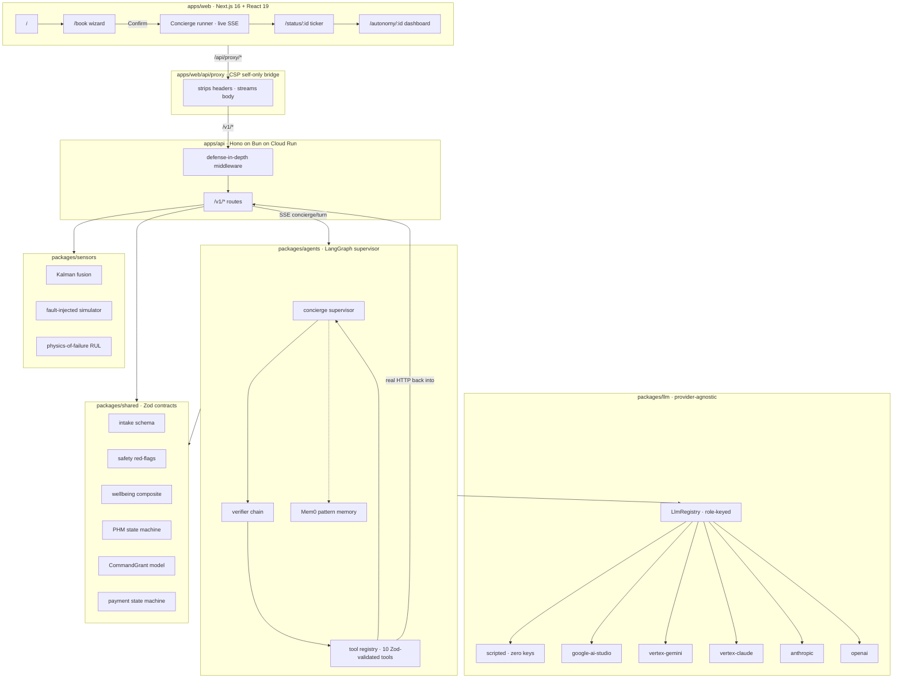
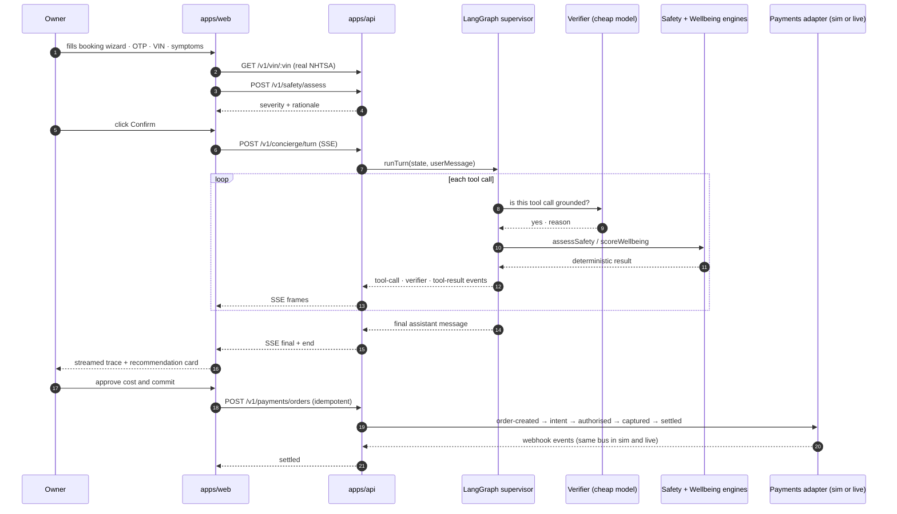

<div align="center">

# VSBS

### Autonomous Vehicle Service Booking System

**Zero-touch. Safety-first. Research-cited. PhD-grade. Production-shape.**

A full-stack, agentic, open-source reference implementation of the next generation of vehicle-service customer experience — built so any OEM can fork it, white-label it, and ship.

[](LICENSE)
[](https://www.typescriptlang.org)
[](https://bun.sh)
[](https://nextjs.org)
[](https://react.dev)
[](https://langchain-ai.github.io/langgraph)
[](https://hono.dev)
[](https://tailwindcss.com)
[](#tests--verification)
[](#tests--verification)
[](https://www.w3.org/TR/WCAG22/)
[](docs/compliance/dpia.md)
[](docs/compliance/fria.md)
[](docs/research/security.md)
[](docs/research/)

**[Quick start](#quick-start) · [Architecture](#architecture) · [Research](#research) · [Roadmap](docs/roadmap-prod-deploy.md) · [Contribute](CONTRIBUTING.md)**

</div>

---

## The pitch in thirty seconds

Most vehicle-service apps optimise for *distance and price*. VSBS optimises for **customer wellbeing** — safety, stress, transparency, trust — and treats the service-advisor job as a **fully autonomous agentic workflow** you can click through on a slow phone with zero human operators in the loop.

It composes six things that nobody usually ships together:

1. A **LangGraph supervisor** with a verifier chain on every tool call.
2. A **provider-agnostic LLM layer** that runs on free-tier Gemini, production Vertex Claude, OpenAI, Anthropic direct, or a **scripted sim driver with zero API keys**.
3. A **deterministic sensor simulator** with Kalman fusion and SOTIF-aligned fault-vs-sensor-failure arbitration.
4. A **prognostic health state machine** per ISO 13374 that refuses autonomous operation when a tier-1 safety-critical sensor is dead.
5. A **DPDP-2025-native** append-only consent log with evidence hashes and a 72-hour breach runbook.
6. A **post-quantum hybrid envelope** for long-lived secrets using Cloud KMS ML-KEM-768 + X25519.

Every architectural decision is traceable to peer-reviewed research or a published standard. See [`docs/research/`](docs/research/) for the citation trail and [`docs/defensive-publication.md`](docs/defensive-publication.md) for the prior-art filing.

<br/>

## What you get when you clone it

| You get | Built from |
|---|---|
| A real `/v1/concierge/turn` SSE endpoint streaming typed agent events | Hono on Bun + LangGraph + scripted LLM |
| A real NHTSA vPIC VIN decode | Free public API, no key |
| A full Razorpay order → intent → authorise → capture → settle flow | Exact prod state machine in sim mode |
| A 4 + 1 step booking wizard that renders the agent trace live | Next.js 16 + React 19 + React Compiler |
| A composite wellbeing score with 10 peer-reviewed sub-scores | `packages/shared/src/wellbeing.ts` |
| A hard-coded safety red-flag gate with post-commit double-check | `packages/shared/src/safety.ts` |
| A CommandGrant capability token model for autonomous handoff | `packages/shared/src/autonomy.ts` |
| A scalar Kalman filter and cross-modal arbitrator for sensor fusion | `packages/sensors/src/fusion.ts` |
| WCAG 2.2 AAA demo banner, 44x44 targets, OKLCH palette, focus-visible rings | `apps/web` |
| 125 unit tests, 25 HTTP smoke tests, full CI pipeline with Trivy SBOM | `.github/workflows/ci.yml` |

<br/>

## Quick start

Prerequisites: **Node 22+**, **pnpm 9+**, **Bun 1.2+**. Nothing else.

```bash
# 1. Clone + install
git clone https://github.com/divyamohan1993/vsbs.git
cd vsbs
pnpm install --ignore-scripts

# 2. Build the library packages
pnpm run build:libs

# 3. Prove the baseline is green
pnpm -r typecheck    # 6/6 packages clean
pnpm -r test         # 125 tests passing
pnpm run build       # full repo build

# 4. Boot the API in sim mode (zero API keys needed)
cd apps/api
LLM_PROFILE=sim PORT=8787 bun src/server.ts &

# 5. Watch a real autonomous booking turn
curl -sN -X POST http://localhost:8787/v1/concierge/turn \
  -H 'content-type: application/json' \
  -d '{"conversationId":"demo","userMessage":"My 2024 Honda Civic is grinding when I brake"}'
```

You should see a live SSE trace — **tool-call → verifier → tool-result → delta → final** — with the deterministic safety and wellbeing engines returning real results, driven by a LangGraph supervisor, through a provider-agnostic LLM layer, on **zero external API calls**.

Flip `LLM_PROFILE=demo` + set `GOOGLE_AI_STUDIO_API_KEY` and the exact same transcript runs on Gemini 2.5 Flash-Lite. Flip to `prod` and it runs on Claude Opus 4.6 via Vertex AI. **One env var. No code change.**

<br/>

## Architecture



**Read in this order:** [`docs/architecture.md`](docs/architecture.md) → [`STACK.md`](STACK.md) → [`docs/research/agentic.md`](docs/research/agentic.md) → [`docs/research/autonomy.md`](docs/research/autonomy.md) → [`docs/research/prognostics.md`](docs/research/prognostics.md) → [`docs/gap-audit.md`](docs/gap-audit.md).

<br/>

## The autonomous booking loop



Every arrow is real code you can read today. Every `sim` path implements the identical state machine as its `live` counterpart, per [`docs/simulation-policy.md`](docs/simulation-policy.md).

<br/>

## Repository layout

```text
.
├── apps
│   ├── api          Hono on Bun · defense-in-depth middleware · 12 route groups · 35 tests
│   └── web          Next.js 16 · booking wizard · live concierge · autonomy dashboard · consent
├── packages
│   ├── shared       Zod schemas · safety · wellbeing · autonomy · PHM · payment state machine
│   ├── sensors      Kalman fusion · simulator with fault injection · RUL models
│   ├── llm          Provider-agnostic LLM · 6 providers · sim / demo / prod profiles
│   └── agents       LangGraph supervisor · verifier chain · Mem0 memory · 10 VSBS tools
├── infra
│   └── terraform    GCP baseline · Cloud Run · Firestore · Secret Manager · IAM
├── docs
│   ├── research          8 cited research documents · the spine of every decision
│   ├── compliance        DPIA · FRIA · AI risk register · breach runbook · retention
│   ├── architecture.md   Synthesis
│   ├── roadmap-prod-deploy.md   93-item build list through Phase 12
│   ├── simulation-policy.md     Sim + live share the state machine · one toggle
│   ├── defensive-publication.md Prior art for 12 inventive concepts · dated 2026-04-15
│   └── gap-audit.md             Honest what-is-real vs what-is-partial inventory
├── .github           Issue + PR templates · CODEOWNERS · dependabot · CI
├── CLAUDE.md         Project brief for any fresh Claude session that opens this repo
├── CONTRIBUTING.md   How to contribute without bouncing
├── SECURITY.md       Vulnerability disclosure policy
├── SUPPORT.md        How to ask questions that land
├── STACK.md          Exact versioned stack choices with justification
├── CHANGELOG.md      Keep a Changelog format
├── CITATION.cff      Academic citation metadata
├── LICENSE           Apache 2.0
└── NOTICE            Attribution framed as an adopter benefit
```

<br/>

## What is autonomous today

VSBS is **L4 within a defined operational design domain** for the *service-advisor* job, and **L0-through-tier-A-AVP** for the *driving* portion — depending on what the vehicle itself actually supports. It never fakes a capability the car does not have.

| Function | Autonomous today | Grade |
|---|---|---|
| Conversation + intake (voice, text, images) | yes | L4 |
| Safety red-flag assessment with double-check | yes, deterministic | L4 |
| Diagnosis (RAG over DTC + TSB, cited) | yes | L4 |
| Dispatch ranking (wellbeing-dominant objective) | yes | L4 |
| Slot booking + load balance | yes | L4 |
| Autonomy capability resolver + grant minting | yes (honest refusal outside Tier A) | L4 |
| Auto-pay within user-set cap, cap bound to the grant | yes | L4 |
| PHM + takeover ladder per UNECE R157 | yes | L4 |
| **Driving to the service centre** | only where the vehicle supports Mercedes/Bosch AVP; human pickup path otherwise | Tier A or L0 pickup |

Read the honest accounting in [`docs/gap-audit.md`](docs/gap-audit.md) and the tiered-autonomy reality check in [`docs/research/autonomy.md`](docs/research/autonomy.md) §1.

<br/>

## Research

Every claim VSBS makes about architecture, safety, wellbeing, autonomy, prognostics, and agentic AI is grounded in a cited source. The research corpus lives at [`docs/research/`](docs/research/):

| Document | What it proves |
|---|---|
| [`agentic.md`](docs/research/agentic.md) | The agent stack (LangGraph · Claude Opus 4.6 · Mem0 · GraphRAG · speculative cascade routing) is April 2026 SOTA |
| [`automotive.md`](docs/research/automotive.md) | The intake schema, VIN decode stack, and India BS6 Phase 2 reality |
| [`dispatch.md`](docs/research/dispatch.md) | Maps + routing + VRP + wellbeing-dominant objective function |
| [`wellbeing.md`](docs/research/wellbeing.md) | The 10-parameter composite score, every sub-score traced to a peer-reviewed source |
| [`security.md`](docs/research/security.md) | PQ hybrid TLS, DPDP 2025, OWASP GenAI Top 10, zero-trust GCP posture |
| [`frontend.md`](docs/research/frontend.md) | Next.js 16 + React 19 + WCAG 2.2 AAA + Maister-aligned copy |
| [`autonomy.md`](docs/research/autonomy.md) | Tiered autonomy reality check and CommandGrant capability model |
| [`prognostics.md`](docs/research/prognostics.md) | ISO 13374 PHM + ISO 21448 SOTIF + uncertainty-aware RUL + UNECE R157 takeover |

Plus [`docs/research/addendum-2026-04-15.md`](docs/research/addendum-2026-04-15.md) with the deltas that landed when parallel specialist agents re-audited the corpus.

<br/>

## Compliance

VSBS ships a full compliance pack at [`docs/compliance/`](docs/compliance/):

- [`dpia.md`](docs/compliance/dpia.md) — DPDP Rules 2025 + GDPR Art. 35 Data Protection Impact Assessment.
- [`fria.md`](docs/compliance/fria.md) — EU AI Act Art. 27 Fundamental Rights Impact Assessment, 10-row go/no-go table.
- [`ai-risk-register.md`](docs/compliance/ai-risk-register.md) — 18 rows mapped to NIST AI RMF 1.0 + OWASP GenAI Top 10 2025, every row citing a concrete source file.
- [`consent-notices/README.md`](docs/compliance/consent-notices/README.md) — Consent notice versioning index with a mermaid lifecycle.
- [`breach-runbook.md`](docs/compliance/breach-runbook.md) — 72-hour DPDP Rule 7 breach notification playbook.
- [`retention.md`](docs/compliance/retention.md) — Per-purpose retention schedule matching `ConsentPurposeSchema`.

None of this is legal advice. It is a starting point that is more complete than what most projects ship on day one.

<br/>

## Tests + verification

VSBS maintains three overlapping verification layers.

**Unit tests — 125 passing across 12 files**

```text
packages/shared : 73 tests (6 files)   safety, wellbeing, autonomy, phm, payment, vehicle
packages/sensors: 17 tests (2 files)   Kalman fusion, RUL models
apps/api        : 35 tests (4 files)   payment state machine, Razorpay sim, OTP, security middleware
```

**Smoke tests — 25 live HTTP probes**

```text
healthz · readyz · llm config · vin (real NHTSA) · safety green + red · wellbeing · otp demo + verify
autonomy eligible + refused · order + intent + authorise + settled · idempotency · validation envelope
404 envelope · HSTS · CSP · nosniff · referrer policy · request-id · rate-limit headers
```

**Live concierge run**

```bash
curl -sN -X POST http://localhost:8787/v1/concierge/turn \
  -H 'content-type: application/json' \
  -d '{"conversationId":"demo","userMessage":"..."}'
```

Produces a real `tool-call → verifier → tool-result → delta → final → end` SSE trace with the deterministic safety and wellbeing engines returning real results.

CI runs all three on every PR. See [`.github/workflows/ci.yml`](.github/workflows/ci.yml).

<br/>

## The simulation policy

> For every external dependency with a `_MODE` toggle, the sim and live drivers implement the identical state machine and behaviour. Promotion is a single environment-variable flip. No code path changes. No behaviour changes. No "cleanup pass before going live."

This is the load-bearing rule that lets VSBS run a full booking end-to-end with zero API keys while being structurally ready for production. Read [`docs/simulation-policy.md`](docs/simulation-policy.md) for the full discipline and the subsystems it applies to.

<br/>

## Defensive publication

Under Apache 2.0 plus public disclosure, [`docs/defensive-publication.md`](docs/defensive-publication.md) establishes twelve inventive concepts as prior art under 35 U.S.C. §102, EPC Art. 54, and Indian Patents Act §13, dated **2026-04-15**. Any later patent filing reading on these concepts is invalidated by this publication.

<br/>

## Roadmap

Phase 1 is complete. The full 93-item build list through Phase 12 is at [`docs/roadmap-prod-deploy.md`](docs/roadmap-prod-deploy.md). Next pending blocks:

1. **Phase 2** — Real Smartcar adapter, EKF / UKF for multi-state channels, command-grant signing with passkeys and ML-DSA-65, Mercedes/Bosch AVP adapter.
2. **Phase 3** — AlloyDB + pgvector + Vertex Vector Search for the repair knowledge graph.
3. **Phase 4** — Dual-region India + US deployment.
4. **Phase 5-7** — DPDP consent manager integration, zero-trust hardening, full observability.

<br/>

## Contributing

We review PRs that cite a paper, a standard, or a concrete production use-case. We reject PRs that weaken a safety invariant, add unjustified dependencies, or introduce placeholders. Full rules at [`CONTRIBUTING.md`](CONTRIBUTING.md). Security findings at [`SECURITY.md`](SECURITY.md). Community questions at [`SUPPORT.md`](SUPPORT.md).

<br/>

## License + attribution

Licensed under the **Apache License, Version 2.0**. See [`LICENSE`](LICENSE) and [`NOTICE`](NOTICE). Short version for adopters:

- You **can** use, modify, ship, white-label, commercialise, and integrate this in any product. No royalty. No permission needed.
- You **must** keep the `LICENSE` and `NOTICE` in any redistribution. The NOTICE is short and is framed as a *benefit* to you: research pedigree, standards trail, open partnership channel, patent safety.
- **Trademarks** are not granted. Pick your own product name.
- **No warranty**. You own your deployment's DPIA, FRIA, and regulatory approvals.

Copyright © 2026 **Divya Mohan** ([dmj.one](https://dmj.one)). Partnerships and OEM integration: `contact@dmj.one`.

<br/>

<div align="center">

**If this helps you ship, consider [starring the repo](https://github.com/divyamohan1993/vsbs) — it is the cheapest way to tell the author the work matters.**

**Built in India. Designed for the world.**

</div>
