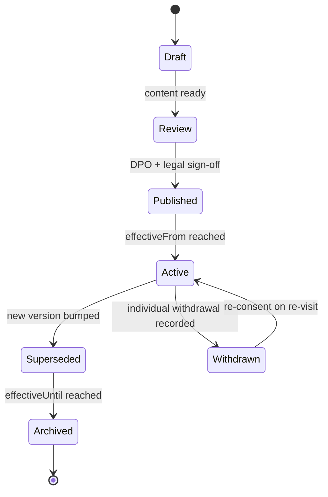

# Consent notice versions

Append-only index of consent notice versions. Each version is immutable. A change of content forces a version bump, re-hash, and mandatory re-consent for all affected principals, per `ConsentNoticeSchema` in `packages/shared/src/schema/consent.ts` and DPDP Rule 3.

## Index

| Version | Effective from | Effective until | SHA-256 hash | Locales | Notes |
|---|---|---|---|---|---|
| 1.0.0 | 2026-04-15 | current | `pending-at-build-time` | en, hi, ta, bn, mr | Initial notice covering all seven purposes |

## Lifecycle

## Field-by-field mapping to ConsentBundleSchema (v1.0.0)

Source of truth: `packages/shared/src/schema/consent.ts`.

| Notice section | Schema field | Required | Default | User-facing text summary |
|---|---|---|---|---|
| Header, version chip | `noticeVersion` | yes | `"1.0.0"` | "Privacy notice 1.0.0, 15 April 2026" |
| Purpose: Book and fulfil your service | `items[].purpose = "service-fulfilment"` | yes | `granted: true` | Required to fulfil the booking contract (DPDP s.7(b)) |
| Purpose: Read your car's diagnostic data | `items[].purpose = "diagnostic-telemetry"` | required if connected-car path used | `granted: false` | OBD, BMS, TPMS, DTCs, freeze-frame |
| Purpose: Use voice and photos you share | `items[].purpose = "voice-photo-processing"` | required if used | `granted: false` | Voice intake, photo evidence, 30-day retention |
| Purpose: Send you offers | `items[].purpose = "marketing"` | no | `granted: false` | Opt-in, revocable, no dark pattern |
| Purpose: Help us improve the model with anonymised data | `items[].purpose = "ml-improvement-anonymised"` | no | `granted: false` | Differential-privacy aggregated only |
| Purpose: Let the car drive itself to service | `items[].purpose = "autonomy-delegation"` | opt-in, required for Tier A | `granted: false` | Geofenced, time-bounded, revocable within 10 s |
| Purpose: Auto-pay within a cap I set | `items[].purpose = "autopay-within-cap"` | opt-in, required for auto-pay | `granted: false` | Cap encoded in signed grant |
| Evidence hash of notice shown | `ConsentRecordSchema.evidenceHash` | yes | SHA-256 of rendered HTML | Proves the exact notice the user saw |
| Notice version stamp on the record | `ConsentRecordSchema.noticeVersion` | yes | `"1.0.0"` | Binds the record to this file |
| Legal basis | `ConsentRecordSchema.legalBasis` | yes | `"consent"` or `"contract"` per purpose | DPDP s.7 |
| Timestamp | `ConsentRecordSchema.timestamp` | yes | server UTC | ISO 8601 |
| IP, redacted | `ConsentRecordSchema.ipRedacted` | yes | first /24 only | Minimum-necessary auditability |

## Versioning rules

1. Content change of any purpose text, any legal basis, or any retention period forces a **new version**. No in-place edit.
2. New version computes a fresh SHA-256 over the canonical rendered notice bytes and stores it in `ConsentNoticeSchema.hash`.
3. On next user visit, the app compares the stored `noticeVersion` on the most recent `consent_log` row for that purpose; if lower than current, the app forces a re-consent modal. This is enforced server-side, not client-only.
4. The superseded version's `effectiveUntil` is set to the new version's `effectiveFrom`; both rows remain visible for audit.
5. All locales in the `locales` record must be updated together; a partial-locale bump is rejected at publish time.

## Where records live

- Append-only writes: Firestore `consent_log/{ownerId}/{recordId}`.
- Notices: Firestore `consent_notices/{version}` and `docs/compliance/consent-notices/v{version}.html` checked into git.
- Erasure: on `DELETE /me`, the per-user DEK is shredded (cryptographic erasure) and rows are tombstoned, per DPDP Rule 10 and `docs/compliance/retention.md`.
