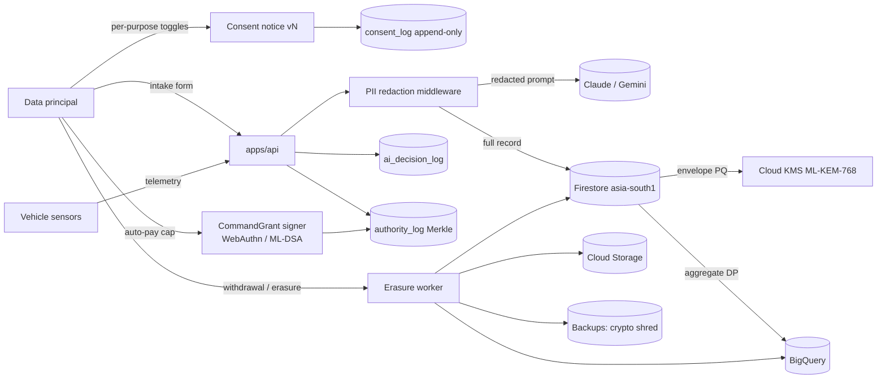

# Data Protection Impact Assessment (DPIA)

**System:** Vehicle Service Booking System (VSBS)
**Version:** 1.0.0
**Date:** 2026-04-15
**Author:** Divya Mohan (DPO, dmj.one)
**Regulatory basis:** DPDP Act 2023, DPDP Rules 2025 (Rules 3, 6, 7, 10), GDPR Art. 35.

## 1. Identification of processing operations

VSBS is a zero-touch autonomous service advisor. It ingests vehicle telemetry, owner identity, and voice or photo evidence; it routes a booking to a service centre; and, for consenting users on supported vehicles, it mints a `CommandGrant` capability token that authorises autonomous drop-off, repair, auto-pay within a user cap, and return delivery.

In scope:

1. Owner account creation and authentication.
2. Vehicle intake (VIN, RC, service history) per `packages/shared/src/schema/intake.ts`.
3. Continuous telemetry ingest (OBD-II, TPMS, BMS, IMU, GPS, camera, microphone) per `docs/research/autonomy.md` §2.
4. Agentic reasoning over the intake and telemetry via LangGraph supervisor with Claude and Gemini.
5. Consent capture and withdrawal per `packages/shared/src/schema/consent.ts`.
6. Autonomy handoff and auto-pay per `packages/shared/src/autonomy.ts`.
7. Post-service feedback and wellbeing metrics per `docs/research/wellbeing.md`.

## 2. Purposes, data categories, retention

Each purpose is a row in `ConsentPurposeSchema`. Retention maps to `docs/compliance/retention.md`.

| Purpose (consent.ts) | Legal basis | Data categories | Retention |
|---|---|---|---|
| `service-fulfilment` | Contract (DPDP s.7(b)) | Name, phone, address, VIN, RC, booking | 7 years (tax law) |
| `diagnostic-telemetry` | Consent | OBD DTCs, BMS, TPMS, freeze-frame | 24 months rolling |
| `voice-photo-processing` | Consent | Voice clips, cabin or exterior photos | 30 days then purge |
| `marketing` | Consent, opt-in | Email, device ID, coarse location | Until withdrawal |
| `ml-improvement-anonymised` | Consent, opt-in | Anonymised telemetry | 36 months, differential-privacy aggregated |
| `autonomy-delegation` | Consent, opt-in | Geofence, grant log, authority chain | 7 years (insurer audit) |
| `autopay-within-cap` | Consent, opt-in | Payment intent ID, cap, quote | 7 years (tax law) |

## 3. Necessity and proportionality

Every field requested is either required by the fulfilment contract or gated behind a separate opt-in toggle with a "Why we are asking" tooltip per `docs/research/wellbeing.md` §3. Marketing and ML-improvement default to off, per DPDP Rule 3. No dark patterns. No bundled consent. Voice and photo inputs run through PII redaction middleware before reaching any model, per `docs/research/security.md` §4.

## 4. Risks to data principals

| Risk | Vector |
|---|---|
| Confidentiality breach | Model provider leak, dep poisoning, insider, rogue tool call |
| Integrity loss | Prompt injection on retrieved TSB, CommandGrant replay, poisoned KG |
| Availability loss | Model provider outage, Cloud Armor rate-limit, DDoS |
| Discrimination | Dispatch bias across geography, vehicle age, gender |
| Rights restriction | Withdrawal ignored, opaque decision, erasure gaps in backups |
| Financial harm | Auto-pay bypass, silent partial payment |
| Physical harm | Red-flag bypass dispatching a customer with failed brakes |

## 5. Measures to address risks

Controls map to `docs/research/security.md` §§5 to 7 and to the live code.

1. Post-quantum hybrid envelope on all long-lived secrets. ML-KEM-768 plus X25519 wrapping an AES-256-GCM DEK, per `docs/research/security.md` §1.
2. Strict CSP with nonce, `frame-ancestors 'none'`, and no `unsafe-inline`, per `docs/research/security.md` §6.
3. PII redaction middleware on every prompt and every log line.
4. Unified error envelope `{error: {code, message, details}, rid}` with a request id; no stack traces to users.
5. Rate limit middleware at Cloud Armor and at the API edge.
6. Hardcoded `SAFETY_RED_FLAGS` cross-checked twice, per `packages/shared/src/safety.ts`.
7. Verifier chain: a second Haiku pass reviews any privileged tool call, per `docs/research/security.md` §4.
8. `CommandGrant` is signed on the owner's device, time-bounded, geofence-bounded, revocable within 10 s, per `packages/shared/src/autonomy.ts`.
9. Auto-pay cap encoded in the signed grant, not a server flag, per `docs/research/autonomy.md` §6.
10. Append-only `consent_log` with SHA-256 evidence hash of the exact notice shown, per `ConsentRecordSchema.evidenceHash`.
11. Per-purpose erasure worker cascades Firestore, Cloud Storage, BigQuery, and performs cryptographic shred of per-user DEKs in backups, per DPDP Rule 10.
12. India residency in `asia-south1`; cross-border transfer blocked by VPC Service Controls by default.
13. Binary Authorization with signed attestations on Cloud Run images.
14. Explanation drawer on every AI decision per GDPR Art. 22 and `docs/research/wellbeing.md` §3.

## 6. Data flow with PII touch-points

## 7. Residual risk rating

| Risk | Inherent | Controls | Residual |
|---|---|---|---|
| Confidentiality | High | 1, 3, 12, 13 | Low |
| Integrity | High | 6, 7, 8, 9 | Low |
| Availability | Medium | 5, graceful degradation | Low |
| Discrimination | Medium | NIST MEASURE 2.5 monitor | Medium, monitored weekly |
| Rights restriction | Medium | 10, 11, drawer | Low |
| Financial harm | High | 9, cool-off, idempotency | Low |
| Physical harm | Critical | 6, red-flag double-check | Low |

## 8. Consultation record

| Party | Role | Date | Notes |
|---|---|---|---|
| DPO | Divya Mohan (dmj.one) | 2026-04-15 | Author |
| Engineering lead | _pending_ | _pending_ | |
| Legal counsel | _pending_ | _pending_ | |
| Customer representative sample | _pending_ | _pending_ | |

## 9. Approval

| Approver | Title | Signature | Date |
|---|---|---|---|
| _pending_ | DPO | | |
| _pending_ | Exec sponsor | | |

Review cadence: 6 months or on any material change to processing, whichever is sooner.
