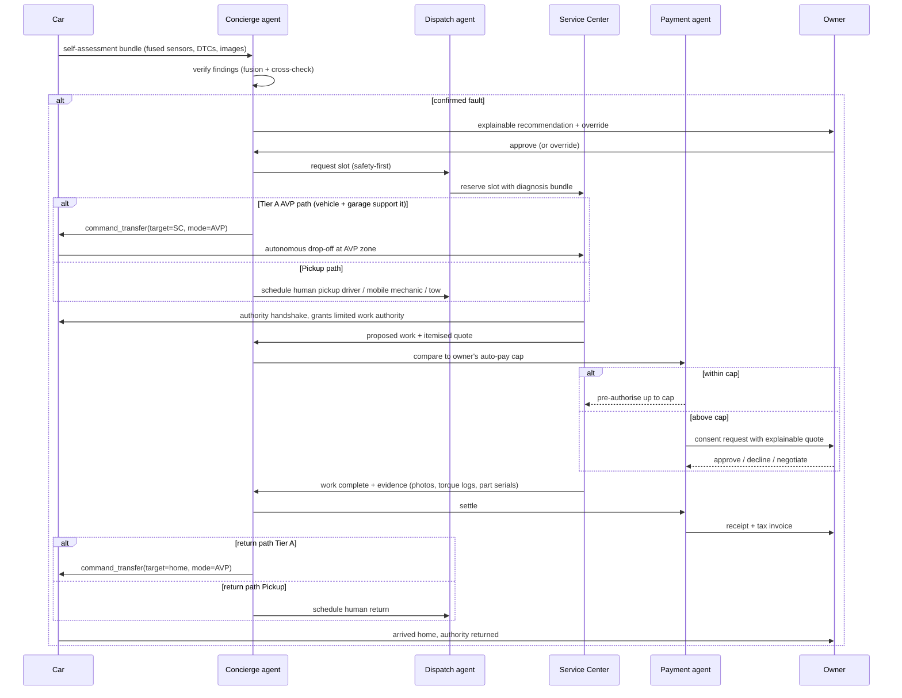

# Research: Autonomous Sensor Suite + Self-Service Orchestration — April 2026

> Goal: the car self-assesses, cross-validates with a full sensor suite, autonomously drives to service (where policy and OEM allow), hands command to the service center, authorises self-repair within a user-set budget, auto-pays, and drives home — all while never fabricating a capability the vehicle doesn't have.

## 1. Reality check on autonomy (April 2026)

This doc is built on what actually exists in production today, plus a clean plug-in for the next tier:

| Tier | What's real today | Source |
|---|---|---|
| **A. Automated Valet Parking (L4, geo-fenced)** | **Mercedes-Benz + Bosch Intelligent Park Pilot**, commercially approved by Germany's KBA, in series production at **APCOA P6, Stuttgart Airport** on S-Class / EQS. **World's first officially approved L4 function for commercial use.** | [Bosch press, world-first approval](https://www.bosch-presse.de/pressportal/de/en/world-first-bosch-and-mercedes-benzs-driverless-parking-system-approved-for-commercial-use-248960.html); [APCOA announcement](https://www.apcoa.com/news/world-first-bosch-and-mercedes-benzs-driverless-parking-system-approved-for-commercial-use/); [New Atlas coverage](https://newatlas.com/automotive/mercedes-bosch-commercial-automated-valet-parking-stuttgart/) |
| **A. Summon / smart-summon (L2 restricted)** | Tesla Actually Smart Summon / Reverse Summon on private property; BMW Parking Assistant Pro; Hyundai Remote Smart Parking Assist. | OEM docs |
| **B. L3 conditional on highways** | **Mercedes DRIVE PILOT** — approved for up to 95 km/h on German Autobahn A8, Nevada, and California; user can legally divert attention. | [Mercedes DRIVE PILOT page](https://www.mercedes-benz.com/en/innovation/autonomous-driving/drive-pilot/) |
| **B. L4 urban robotaxi (geo-fenced, operator-owned fleets)** | Waymo One (Phoenix, SF, LA, Austin, Miami), Zoox (LV), WeRide / Pony.ai / Baidu Apollo Go (China cities). Consumer-owned cars are not yet L4 anywhere. | OEM / regulator pages |
| **C. True door-to-door L4/L5 for privately-owned cars** | **Not commercially available** as of April 2026. Roadmap item. | — |

**Our stance:** the full self-drive-to-service feature is delivered as a **tiered pipeline**. For a Mercedes S-Class entering an AVP-approved garage, tier A runs for real via the OEM API. Outside of that envelope, the system requests a **human driver + optional mobile mechanic pickup** — the orchestration, authority handoff, auto-pay, and re-delivery flow still runs end-to-end with a human doing the driving portion, and the UX is identical so the customer experience doesn't degrade. When a customer's car gains a higher capability tier, the same orchestration transparently uses it.

No fabrication. No "pretend the car drove itself."

## 2. Sensor suite (real + simulated)

We define the full sensor suite a flagship vehicle would carry. Each channel is either **real** (fed from an actual device/API we support today) or **simulated** by our `sensors-sim` package with realistic noise models so the pipeline is testable end-to-end.

| Channel | Real source today | Simulator |
|---|---|---|
| **VIN + odometer + fuel + SoC** | Smartcar API / OBD-II mode $01 / mode $09 | ✓ |
| **OBD-II DTCs (mode $03)** | OBD-II dongle / Smartcar | ✓ |
| **Freeze-frame (mode $02)** | OBD-II dongle | ✓ |
| **Readiness monitors (mode $01 PID $01)** | OBD-II dongle | ✓ |
| **Tire pressure + temperature** | Smartcar (where supported) / OBD / TPMS sensors | ✓ with slow leak + puncture models |
| **Battery BMS (SoC, SoH, cell voltage, temps)** | Smartcar EV / OBD-II UDS (ISO 14229) | ✓ with cell imbalance model |
| **Brake pad wear** | Some OEMs via OBD; else user-entered last-inspection | ✓ |
| **Wheel-speed + ABS flags** | CAN via OBD-II | ✓ |
| **Accelerometer / gyro (IMU)** | Phone `DeviceMotionEvent` + dashcam IMU | ✓ 6-DOF with bias drift |
| **GPS position + heading + speed** | Phone Geolocation API + vehicle GPS | ✓ with urban multipath noise |
| **Cameras — front / rear / surround / cabin** | Phone camera + dashcam RTSP where present | ✓ synthetic frames, fault injection (blur, glare, lens contamination) |
| **LiDAR points** | None for consumer ingest; roadmap | ✓ simulated point cloud at 10 Hz |
| **Radar tracks** | None for consumer ingest; roadmap | ✓ |
| **Ultrasonics** | None for consumer ingest; roadmap | ✓ |
| **Microphone (engine / brake / road noise)** | Phone mic + dashcam mic | ✓ library of labelled fault sounds |
| **HVAC + cabin sensors** | Smartcar where supported | ✓ |

**Real channels activate** when their source is connected and authenticated. Everything else runs through the simulator so the agent pipeline, fusion, and fault-detection logic can be developed, tested, and demoed without hardware. The simulator is **not** used to fake data to the customer — it runs on synthetic vehicles for QA only, and every simulated channel is stamped `origin: "sim"` and blocked from entering a real customer's `ai_decision_log`.

## 3. Sensor fusion and fault tolerance

**Principle: never act on a single sensor.** Any fault assertion requires at least two **independent** sources of evidence, or — if only one is available — it is raised as a *suspected* finding, not a confirmed one. This is standard practice in automotive perception literature.

- **Kalman / EKF / UKF stack** for continuous signals (speed, position, heading, BMS SoC estimate, tire-pressure trend). The innovation residual of the filter is itself a **health indicator** — large, sustained residuals indicate mis-calibration or sensor failure ([Chinese J. Mech. Eng. 2021 "Deep-learning Data Fusion for Sensor Fault Diagnosis and Tolerance in AVs"](https://cjme.springeropen.com/articles/10.1186/s10033-021-00568-1), [ScienceDirect Late Fusion Kalman 2025](https://www.sciencedirect.com/science/article/pii/S2405896325030290), [Redundancy-Aware Multi-Sensor Fusion for Resilient Perception 2025](https://www.researchgate.net/publication/397637601_Redundancy-Aware_Multi-Sensor_Fusion_for_Resilient_Perception_in_Intelligent_Vehicles)).
- **Adaptive weighting** — each sensor gets a real-time trust weight based on residual history + self-reported health; a sensor whose weight falls below 0.2 is isolated and flagged.
- **Cross-modal validation** — for discrete events (warning light lit, DTC stored) we require a confirming modality: a "brake warning red" reading must be backed by either a brake-system DTC OR an anomalous brake-pressure residual OR user-reported pedal softness. Otherwise we ask the user and flag the cluster sensor as suspect.
- **Fault vs sensor-failure arbitration** — formalised as a three-state test:
  1. **Confirmed fault** — ≥ 2 independent channels agree.
  2. **Suspected fault** — 1 channel reports, no confirmation, historical reliability high → ask user / request additional capture.
  3. **Sensor failure** — 1 channel reports, other channels contradict, or residual is physically implausible → raise sensor-health ticket, do not treat as a vehicle fault.

Implementation lives at [`packages/sensors/src/fusion.ts`](../../packages/sensors/src/fusion.ts).

## 4. Autonomous self-service orchestration

End-to-end flow ("from-home to fixed to home"), with **real APIs where they exist** and **a human driver + pickup fallback elsewhere**:



## 5. Command authority handoff

Command authority is modelled as a **signed, time-bounded capability token**, never an open connection. Shape:

```
CommandGrant {
  grantId, vehicleId, grantee (SC id), scope: ["diagnose" | "drive_to_bay" | "repair" | "test_drive" | "drive_home"],
  notBefore, notAfter,                        // ≤ 6 h
  geofence: {lat, lng, radiusMeters},         // service area only
  maxAutoPayINR,                              // ceiling
  mustNotify: ["start", "any_write", "finish"],
  signer: owner,                              // ML-DSA + Ed25519 hybrid
  witnesses: [concierge, insurer]             // co-signatures
}
```

- Tokens are signed on the owner's device (WebAuthn + passkey or hardware key). Server signs as witness.
- Scopes are **least-privilege**: driving to the bay is a separate grant from performing repairs.
- Every action under a grant is appended to `authority_log` with cryptographic chain (Merkle) — the owner can verify the service center did nothing outside scope.
- Revocation: owner can revoke instantly via app; the car and SC must honour revocation within `≤ 10 s` (ping-frequency hardcoded).

## 6. Auto-pay cap policy

User sets:
- **Daily ceiling** (`maxAutoPayDailyINR`, default ₹0 — off).
- **Per-service ceiling** (`maxAutoPayPerServiceINR`).
- **Per-category ceiling** (routine maintenance vs diagnostic vs accident-repair).
- **Forbidden categories** (e.g., body paint never auto-pays).

Rules:
1. Auto-pay fires only on itemised quotes from trusted SCs with a positive wellbeing score.
2. Each auto-pay is a reserved-hold at a **Payment Intent** level (Razorpay / Stripe / UPI) — we never move money without a PI.
3. If the final bill exceeds the cap by any amount, **the whole transaction escalates to manual approval** — no silent partial.
4. A 15-minute sliding window lets the user reverse an auto-pay instantly (cooling-off, Maister friendliness principle).
5. The cap is encoded in the `CommandGrant` token, not as a server-only flag, so the SC cannot request more than the grant allows even if our server is compromised.

## 7. Legal / insurance gates

- **Insurance check** before any autonomous movement — if the owner's policy does not cover autonomous operation under the relevant tier, we refuse and offer a human driver pickup. We integrate with the insurer's API (or have the owner upload the policy PDF which we parse with Document AI).
- **Jurisdiction check** — the geofence in the grant is clipped to legally-approved zones per tier (AVP zones for tier A, specific highway segments for DRIVE PILOT, etc.).
- **Audit trail** — every grant + handoff + action is immutable-logged and exportable for the owner and the insurer.

## Sources

- [Bosch press release — World-first approval of AVP](https://www.bosch-presse.de/pressportal/de/en/world-first-bosch-and-mercedes-benzs-driverless-parking-system-approved-for-commercial-use-248960.html)
- [APCOA — AVP Stuttgart commercial launch](https://www.apcoa.com/news/world-first-bosch-and-mercedes-benzs-driverless-parking-system-approved-for-commercial-use/)
- [New Atlas — AVP Stuttgart](https://newatlas.com/automotive/mercedes-bosch-commercial-automated-valet-parking-stuttgart/)
- [Mercedes DRIVE PILOT](https://www.mercedes-benz.com/en/innovation/autonomous-driving/drive-pilot/)
- [Chinese J. Mech. Eng. — Deep-learning Data Fusion for AV Sensor Fault Diagnosis 2021](https://cjme.springeropen.com/articles/10.1186/s10033-021-00568-1)
- [Late Fusion Kalman V2I 2025 — ScienceDirect](https://www.sciencedirect.com/science/article/pii/S2405896325030290)
- [Redundancy-Aware Multi-Sensor Fusion 2025](https://www.researchgate.net/publication/397637601_Redundancy-Aware_Multi-Sensor_Fusion_for_Resilient_Perception_in_Intelligent_Vehicles)
- [Multi-Sensor Data Fusion for Unmanned Driving 2025 — ACM](https://dl.acm.org/doi/10.1145/3744439.3744450)
- [ISO 14229 UDS](https://www.iso.org/standard/72439.html)
- [SAE J3016 levels of driving automation](https://www.sae.org/standards/content/j3016_202104/)
