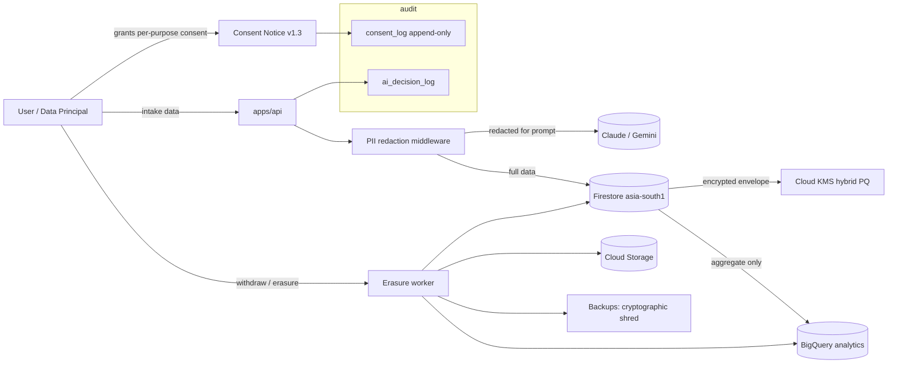

# Research: Security, Privacy, Compliance — April 2026

> Goal: production-grade security from line one. Post-quantum hybrid, DPDP-native, GDPR-ready, agentic-AI-aware.

## 1. Post-quantum cryptography status (April 2026)

- **FIPS 203 (ML-KEM)** is a published NIST standard for lattice-based key-encapsulation ([FIPS 203 final](https://csrc.nist.gov/pubs/fips/203/final)). Parameter sets: ML-KEM-512, ML-KEM-768, ML-KEM-1024. **ML-KEM-768 is recommended for general-purpose**; ML-KEM-1024 for CNSA 2.0 / higher-security. ([AWS-LC FIPS 3.0 post](https://aws.amazon.com/blogs/security/aws-lc-fips-3-0-first-cryptographic-library-to-include-ml-kem-in-fips-140-3-validation/))
- **Hybrid TLS 1.3** — IETF drafts `draft-ietf-tls-mlkem` and `draft-ietf-tls-ecdhe-mlkem` specify hybrid ECDHE+ML-KEM group `X25519MLKEM768` (and `SecP256r1MLKEM768`) for TLS 1.3 key exchange ([draft-ietf-tls-mlkem](https://datatracker.ietf.org/doc/draft-ietf-tls-mlkem/), [draft-ietf-tls-ecdhe-mlkem](https://datatracker.ietf.org/doc/draft-ietf-tls-ecdhe-mlkem/)). AWS s2n-tls and AWS-LC 3.0 already support it in production ([AWS deploying FIPS 203 at AWS, NIST workshop 2025](https://csrc.nist.gov/csrc/media/Presentations/2025/building-post-quantum-cloud-services/images-media/buillding-pw-cloud-services.pdf)).
- **ML-DSA (FIPS 204)** and **SLH-DSA (FIPS 205)** are the matching signature standards and also published.

**Our deployment:** Cloud Run public ingress terminates TLS at Google Front End (GFE). GCP has begun rolling out ML-KEM-768 hybrid groups at GFE during 2025–2026. We will **require** that the TLS policy prefers `X25519MLKEM768` when available and document fallback order. For code-signing of our own container builds we use **ML-DSA-65 via Cloud KMS — now GA**. Cloud KMS has launched both **quantum-safe KEMs (ML-KEM)** and **quantum-safe digital signatures (ML-DSA + SLH-DSA)** for production use ([KMS PQ-KEM announcement](https://cloud.google.com/blog/products/identity-security/announcing-quantum-safe-key-encapsulation-mechanisms-in-cloud-kms), [KMS PQ-signatures announcement](https://cloud.google.com/blog/products/identity-security/announcing-quantum-safe-digital-signatures-in-cloud-kms)). All long-lived secrets (refresh tokens, customer PII encryption keys) encrypted with a **hybrid envelope**: AES-256-GCM DEK, wrapped by an ML-KEM-768 + X25519 hybrid KEK in Cloud KMS.

## 2. DPDP Act (India) — current state

- **DPDP Rules 2025** were notified by MeitY on **14 Nov 2025** ([PIB release](https://www.pib.gov.in/PressReleasePage.aspx?PRID=2190655), [PDF of rules](https://static.pib.gov.in/WriteReadData/specificdocs/documents/2025/nov/doc20251117695301.pdf), [India Briefing summary](https://www.india-briefing.com/news/dpdp-rules-2025-india-data-protection-law-compliance-40769.html/)).
- **Phased enforcement:** Rule 4 (Consent Management) takes effect **Nov 2026**; Rules 3, 5–16, 22, 23 (notices, security, breach, erasure, contact, children, rights, cross-border, exemptions, SDF obligations) at **May 2027** ([Lexology guide](https://www.lexology.com/library/detail.aspx?g=7e3af947-10aa-4712-bc1e-54179a613409), [Scrut.io practical guide](https://www.scrut.io/post/dpdp-rules)).
- **Consent must be** free, specific, informed, unconditional, unambiguous, affirmative, withdrawable at any time; a **separate consent notice** per purpose; **consent managers** act as intermediaries without reading the underlying PII.

**Our implementation:**

1. **Per-purpose bundled consent** at intake, each with its own toggle: (a) service fulfilment [required], (b) diagnostic telemetry ingest [required for connected-car path], (c) voice/photo processing [required if used], (d) marketing [opt-in only], (e) anonymised ML improvement [opt-in only]. Each is a row in `consent_log` with timestamp, purpose-id, version-of-notice, legal-basis.
2. **Consent-manager-compatible API** — we expose a REST endpoint that accepts tokens from DPDP-registered Consent Managers when those land.
3. **Notice** in user's preferred language, versioned, diffed; ever-changing notice triggers re-consent.
4. **Right to erasure** — `DELETE /me` cascades to Firestore + Cloud Storage + BigQuery + backups per Rule 10; cryptographic erasure for backups (shred the per-user DEK).
5. **Breach notification** — automated pager + 72 h templated notice to the Data Protection Board under Rule 7.
6. **Data localisation** — India-resident buckets and Firestore `asia-south1` default; cross-border transfer gated behind explicit purpose + SDF classification.
7. **Children's data** — Rule 11; age-gate at signup, verifiable parental consent flow for < 18.

## 3. GDPR + EU AI Act parallel

- GDPR Art. 22 (solely automated individual decisions with legal or similarly significant effects) applies — we're routing services and auto-paying up to a cap, so we ship **meaningful explanations + override + contestation**. Stored per-decision in `ai_decision_log`.
- **EU AI Act** classification: routine service-advisor isn't high-risk, but the autonomy-handoff + auto-pay feature is — we document a **fundamental-rights impact assessment** (FRIA) under Art. 27 before enabling the autonomy path in any EU deployment.

## 4. Agentic AI security

- **OWASP GenAI Top 10 2025** ([OWASP](https://genai.owasp.org/llm-top-10/)) — we mitigate:
  - **LLM01 Prompt Injection** — (a) tool-use schema validation, (b) strip Markdown / HTML in retrieved context, (c) separate *system* (trusted) and *retrieved* (untrusted) channels in the prompt, (d) deny-list well-known jailbreak patterns, (e) a second Haiku verifier reviews any tool call with a privileged scope.
  - **LLM02 Sensitive Info Disclosure** — PII redaction middleware on all prompts and all logs.
  - **LLM06 Excessive Agency / LLM08 Excessive Agency (2025)** — every tool has an explicit scope + owner. The auto-pay tool requires a signed user cap token with expiry.
  - **LLM09 Misinformation** — groundedness gate with citations required on every user-facing factual claim.
  - **LLM10 Unbounded Consumption** — per-session cost ceiling; per-IP rate limit at Cloud Armor.
- **NIST AI RMF 1.0** and **MITRE ATLAS** mapped in `docs/compliance/ai-risk-register.md`.

## 5. Zero-trust on GCP

- **BeyondCorp Enterprise + Identity-Aware Proxy** for all admin UIs and SIEM.
- **VPC Service Controls** around Firestore, BigQuery, Cloud Storage, Vertex AI — blocks data exfiltration even if creds leak.
- **Binary Authorization** with signed attestations: only images signed by our CI build chain may run on Cloud Run.
- **Workload Identity Federation** — no service-account JSON keys anywhere; GitHub Actions authenticates via OIDC.
- **Secret Manager + KMS auto-rotate** on 30-day cadence for API keys.
- **Cloud Armor** pre-configured WAF rules (OWASP CRS 4.x + Google-managed), reCAPTCHA Enterprise on signup / auto-pay authorisation.
- **Artifact Registry + SBOM** generation in CI; Trivy + OSV-Scanner gate on critical vulns.

## 6. HTTP security headers baseline

| Header | Value |
|---|---|
| `Strict-Transport-Security` | `max-age=63072000; includeSubDomains; preload` |
| `Content-Security-Policy` | strict, nonce-based, no `unsafe-inline`, `frame-ancestors 'none'`, `upgrade-insecure-requests` |
| `X-Content-Type-Options` | `nosniff` |
| `Referrer-Policy` | `strict-origin-when-cross-origin` |
| `Permissions-Policy` | geolocation / camera / microphone allowed only on consent-gated routes |
| `Cross-Origin-Opener-Policy` | `same-origin` |
| `Cross-Origin-Embedder-Policy` | `require-corp` where possible |
| SRI | required on every external script/style |

## 7. Threat model (concise)

| Asset | Threat | Mitigation |
|---|---|---|
| Customer PII (name, phone, address, VIN, telemetry) | Exfiltration | VPC-SC, KMS envelope, least-privilege, field-level encryption for VIN+phone |
| Payment capability + auto-pay cap | Abuse / replay / malicious agent | Signed cap token with expiry + amount; per-transaction confirmation if > ₹0 until consent to automation; hardware-backed cap signature |
| Dispatch decision | Poisoned input / adversarial prompt | Prompt-injection controls; verifier chain; red-flag override |
| Agent tool access | Lateral escalation | Per-specialist scope, no tool does what another specialist's tool does |
| Model API keys | Leakage | Only injected at runtime from Secret Manager, never baked into images |
| Connected-car OAuth tokens | Theft | Stored encrypted, bound to device + user, refresh-rotation enabled |
| Admin SIEM | Insider misuse | IAP + BeyondCorp + session recording |
| Supply chain | Dep poisoning | lockfile-committed, SBOM, Trivy, Binary Auth |
| Repair KG | Data poisoning | Source allow-list + signed corpora + diff review |

## 8. DPDP consent + data flow (mermaid)

Sources:
- [FIPS 203 — NIST](https://csrc.nist.gov/pubs/fips/203/final)
- [draft-ietf-tls-mlkem](https://datatracker.ietf.org/doc/draft-ietf-tls-mlkem/)
- [draft-ietf-tls-ecdhe-mlkem](https://datatracker.ietf.org/doc/draft-ietf-tls-ecdhe-mlkem/)
- [AWS-LC FIPS 3.0 post](https://aws.amazon.com/blogs/security/aws-lc-fips-3-0-first-cryptographic-library-to-include-ml-kem-in-fips-140-3-validation/)
- [AWS deploying FIPS 203 NIST workshop 2025](https://csrc.nist.gov/csrc/media/Presentations/2025/building-post-quantum-cloud-services/images-media/buillding-pw-cloud-services.pdf)
- [DPDP Rules 2025 PIB](https://www.pib.gov.in/PressReleasePage.aspx?PRID=2190655)
- [DPDP Rules 2025 PDF](https://static.pib.gov.in/WriteReadData/specificdocs/documents/2025/nov/doc20251117695301.pdf)
- [Lexology DPDP 2025 guide](https://www.lexology.com/library/detail.aspx?g=7e3af947-10aa-4712-bc1e-54179a613409)
- [Scrut.io DPDP practical guide](https://www.scrut.io/post/dpdp-rules)
- [OWASP GenAI / LLM Top 10 2025](https://genai.owasp.org/llm-top-10/)
- [NIST AI RMF 1.0](https://www.nist.gov/itl/ai-risk-management-framework)
- [MITRE ATLAS](https://atlas.mitre.org/)
- [EU AI Act — Regulation (EU) 2024/1689](https://eur-lex.europa.eu/eli/reg/2024/1689/oj)
